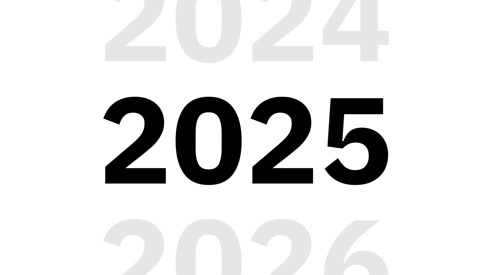

# Year 2025

> `2025 December 31` `7 minutes to read`

This was an awesome year, probably the best one I've ever had. There were a lot of ups and downs, and I'm impressed by how much I went through.

The most impactful thing I did is probably creating and systematically writing to my [personal journal](../journal). I started it because of the deep hurt, despair and all sorts of other painful emotions that were eating me from inside. Everything felt so messy and scattered, and I felt a need to do something towards solving that. I had no people around to whom I could talk. To me it was clear that everyone I knew would not understand my struggle or would disregard my feelings. Creating a journal was my escape hatch. I heard a lot about the benefits of writing thoughts down, so I decided to give it a try, and to give it a little bit of charm and create some sense of importance, I decided to do it publicly.

It seems like the pain of shame, guilt, loneliness, inferiority and the feeling of inadequacy was always the primary fuel for me.

A lot has changed. I believe I managed to almost fully switch to more sustainable and fulfilling fuel. I want to increase my understanding of everything I observe. I crave answers for all the questions that I have, and at the same time I want to be useful to others. Curiosity is probably the best all-in-one word which explains the desires I have right now.

My most successful project so far was born this year. I got into the ergonomic keyboards hobby last year, and it was an amazing journey. I started with [Corne](https://github.com/foostan/crkbd), switched to [Chocofi](https://github.com/pashutk/chocofi) and ended up building my own keyboard called [Anywhy Flake](https://github.com/anywhy-io/flake). There always were some flaws I could notice in other designs, and I was always half satisfied. I wanted to get a simple, versatile and clean experience, and I simply couldn't find it. Out of pure curiosity I decided to figure out how difficult it would be to create my own PCB design. I'd been playing around during the previous year and created several simple designs like [this one](https://github.com/axseem/folderlike). At some point the process felt fluent, I had enough knowledge and experience to come up with a design which would solve most of the problems I'd had with other keyboards. I [posted a prototype](https://www.reddit.com/r/ErgoMechKeyboards/comments/1h7lf72/anywhy_flake_slim_design_wired_and_wireless/) on Reddit during December 2024, and then [released version 1.0](https://www.reddit.com/r/ErgoMechKeyboards/comments/1hyxu77/meet_the_anywhy_flake_v10/) in January 2025. The original design was improved so much during this year, to the point that I [released a reworked version 2.0](https://www.reddit.com/r/ErgoMechKeyboards/comments/1nm1s6r/anywhy_flake_v2_an_opensource_wireless_split/). There were a lot of people who absolutely loved what I'd made, and I liked how warm and friendly the community felt.

Another huge thing that happened was me dropping out of university. I entered [CTU](https://en.wikipedia.org/wiki/Czech_Technical_University_in_Prague) in the middle of 2024, but by January 2025, I already knew that something was extremely off. I didn't feel like I was getting much useful knowledge at all, tasks were repetitive and simply boring. I'd been programming from my early teen years, so a lot of what was taught I already knew. Some subjects were new to me, like advanced linear algebra or discrete mathematics, and even though they were interesting, I struggled to find ways to apply this knowledge. I could imagine some scenarios in which this knowledge would be useful, but didn't understand what stopped me from learning all of that the moment a need would emerge. Everything I knew I learned myself, so why now would it be different? Obviously, there are some flaws in the reasoning here, because wide knowledge often allows to see unconventional ways to apply it, which would not be visible otherwise, but it was not enough of an argument for me at that moment. The final thing that made up my mind was the vibes I felt during studies. You know, I was expecting to meet so many enthusiastic, ambitious, technical, and nerdy people like me, but the reality hit me hard. From what I saw, the majority of people were absolutely cold to the industry, they were not interested in technologies as much as I was, and all they were doing was using ChatGPT to get homeworks done, study the bare minimum to pass the exams, and then celebrate with a glass of beer. It was clear to me that I was a misfit, and that I was simply losing my time there, so I stopped attending classes the second half of the year, and this summer I submitted a paper stating that I was leaving the university.

There was a lot of uncertainty and emotional pressure. I felt like an imposter, like I was just silly, trying to pretend that I'm some sort of genius who doesn't need all of this crap. I had this feeling like I might be doing something wrong and simply didn't realize it. It was really hard to feel adequate when literally everyone around me was okay with how things were, and saw some sort of value in what we were doing, while I felt like I was just wasting my precious time. A huge part of the problem were my parents. I felt zero support and zero effort to try to understand me, and help me go through this complex situation. My father was literally saying that only a stupid person would do what I was trying to do, and any of my attempts to have a structured, rational discussion were ignored. Instead I got a bunch of "I'm older so I know better", "I don't care what you are saying" or "I want you to have a degree so do what I want" kind of statements. In the end, as it always was in my life, I was the only one on whom I could rely, and so I was mentally going through all the possible scenarios, trying to identify all the pros and cons of every possible decision and find a rational solution. I came to the conclusion that I was already wasting time, so leaving was a better choice, as it would unlock more time for potentially useful activities. Back then I decided to fully trust myself and do what I thought was better for me, and I'm so grateful I did.

October 2025 - I got a job. I'm working as a Software Engineer at [Make](https://www.make.com/), in the local Prague office. I was finally able to fully pay my bills, and not feel like I'm dependent on someone! It was a truly elevating moment. I had a clear growth direction, I was doing what I love and I was getting paid for that. I've been working here for several months already, and although there are obviously some problems present, I'm happy to be here. I finally feel like I'm on the right path, like I'm doing something meaningful and have much more opportunities in front of me.

There are also a lot of other small but important things that happened. For instance, my self-improving habits were gradually improving and expanding, to the point where it started to look like I have exponentially growing progress. I'm so much better at sticking to my sleep schedule. I built and continuously followed a skin care routine. This year I was working out more than ever before. I've built a sustainable workout routine for my long-term health development. For more than a month already I've been following a keto diet, and feel an astonishing mental clarity and depth of focus as a result. Generally I have a much greater sense of purpose and it feels like I'm in control of my life and I dictate my future. I learned to unconditionally love myself, and my understanding of my inner self jumped to an absolutely new level. I figured out that I've always been trying my best, trying to stay true to myself, and absolutely don't deserve all the burden I'd been carrying with me.

To be frank, this year was so unbelievably good, I'm scared of not having the same kind of jump in the next years. The kind of life I live right now feels like the most addictive game I've ever played, and I'm afraid of losing the rush I feel right now. There are still so many unsolved issues and insecurities I have. I can still observe so many flaws in my work, my reasoning, my behaviour and so many other aspects of life, and I'm actually happy about it. I'm never done and I'm always in the process of becoming a better version of myself, which is the kind of person I want to be.

People love to do New Year's resolutions, and I've been thinking if I should do it too. It seems like it would be nice for me to actually stop for a second and appreciate the amount of progress I'm making. On any particular day, it doesn't look like much of a change, but zoom out and the picture is stunning. In my flow of thoughts, I've already expressed my gratitude several times, but I still feel like I lack the words to express how lucky I feel.

It is very easy for me to focus on what is "urgent" and lose sight of what is "important". To make my direction clear, I think there are several things I want to focus on in the next year. I want to share knowledge with others, develop my entertaining skills and make content creation a bigger part of me. Another thing, the importance of which I often neglect, is the expansion and deepening of my relationships. I need to develop more close friendships and actually do something to meet a lovely girlfriend and potentially build deep and lasting relationships. That was always something I struggled with, and I thought that as I grew, it would get fixed automatically, but it seems like instead it evolved, my expectations of relationships gradually increased, and the problem became only more complex.

There is one last small thing I want to do in the next year. It's pretty simple to do on paper, but it's really hard to mentally commit to it. I want to get a puppy. I've been thinking a lot about it, and I love the idea of having a dog, and I can easily see how profoundly this change can impact my life. The problem is that I always feel like I'm not ready, and it's not a suitable time. I tend to believe that I'll never be ready and that's one of these things where I have to just embrace the uncertainty and simply do it.

It was a lot of thoughts and emotions. Thank you everyone who read to this moment and is still with me! It's hard to describe how much I appreciate every bit of your interest, attention and especially shared passion.

Happy New Year!
