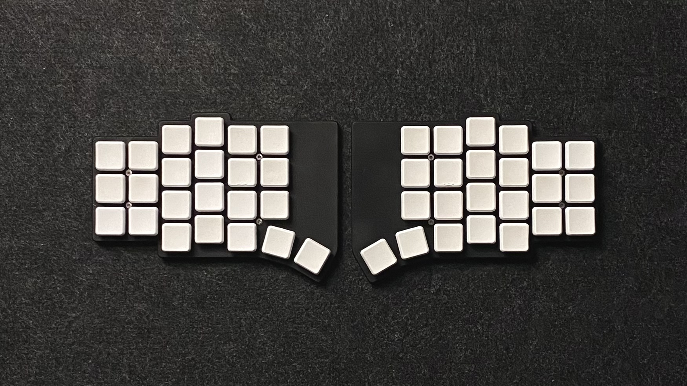
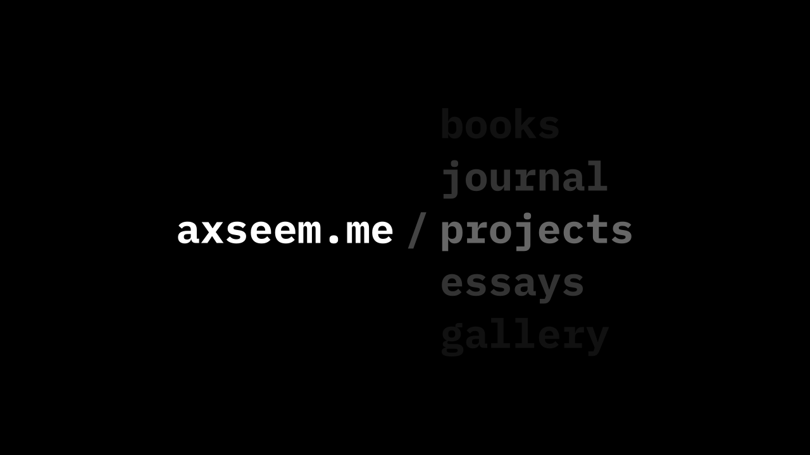

# projects 

[**Anywhy Flake**](https://github.com/anywhy-io/flake) - _An open-source, wireless, split ergonomic keyboard designed to be productive, healthy, and enjoyable_

`KiCad` `FreeCAD` `Hardware`

[**axseem.me**](https://github.com/axseem/website) - _Simple, stylish, completely markdown driven personal website. You are using it right now._

`Typescript` `SvelteKit` `Web`
