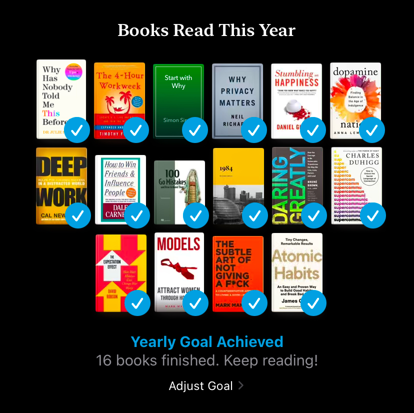

+++
layout = '../../layouts/Markdown.astro'
date = '2024-12-30 18:23 +0100'
title = 'One Year - Sixteen Books'
summary = 'I thought books were useless. I was so wrong'
+++

I was never into books. For me, reading seemed boring and unproductive. I thought books were useless considering all the various novel ways to consume the information.

I was so wrong.

## How did I get to this point?

At the beginning of 2024 I was looking for ways to drastically improve my lifestyle. That's when I decided to give books a chance. [Atomic Habits by James Clear](https://jamesclear.com/atomic-habits) caught my eye. The topic seemed interesting enough and it had a bunch of good reviews.

It was life changing. I was not expecting to get such a great amount of information and for it to be such a pleasant experience. Almost immediately, I felt like I needed more.

The book contained a short review by [Mark Manson](https://markmanson.net). I explored his work and discovered he had written several bestsellers, my choice fell on [The Subtle Art of Not Giving a F*ck](https://markmanson.net/books/subtle-art) and [Models](https://markmanson.net/books/models).

Those books were amazing, and the information I discovered has changed the way I see the problems and hugely influenced the way I was living.

It became clear how useful the habit of reading is, and how much joy it brings. Being impressed with the results, I decided to set a goal of reading 16 books by the end of the year. Honestly it seemed like a huge amount considering I've been reading only for a few months. Nevertheless, I quickly accepted such an ambitious challenge. It was the right choice.

## How did it go?

It went great! Turns out all this time, I've been just ignoring the whole world of highly accessible and useful knowledge. 

Sure, it was not always smooth. There were days when I just didn't feel like reading, or the information from the book was somewhat difficult to absorb. However, those obstacles were easy to overcome, especially considering all the benefits I was getting in exchange.

Also during the journey, I discovered something unexpected - the superiority of text-based information. Reading is extremely fast, content is easily navigable when organized in chunks, and the distraction-free nature of plain text helps maintain focus for extended periods.

## So what is next?

Looking back, I'm extremely happy with the decisions I made.

I already have a queue of books that I can't wait to read, and with time it only grows. It's no longer about a funny challenge but an identity. Reading slowly became a part of me, and revealed the person I want to be.

The future looks limitless and I'm extremely excited about it.